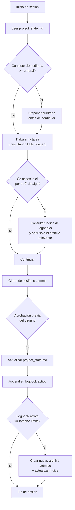

# logsayer — Especificación maestra

CLI open source, agnóstico de agente, que extiende el patrón spec-driven (tipo GitHub Spec Kit) con 3 capas que ese patrón no resuelve: continuidad de estado entre sesiones, bitácora histórica particionable, y verificación continua (mecánica + semántica) de que el código sigue siendo lo que la especificación dice.

Este documento reemplaza y consolida: la arquitectura genérica de capas, el plan de fases del CLI, el tema narrativo Dune, la clasificación bot/subagente, la estrategia multi-agente, los riesgos conocidos de diseño, y los umbrales de configuración — es la única fuente de verdad a partir de ahora.

---

## 1. Nombre y posicionamiento

- **Nombre:** `logsayer` — portmanteau de "log" (continuidad/bitácora) + "sayer" (de Truthsayer, verificación). Verificado libre en PyPI y GitHub.
- **Mensaje de una línea:** *Spec Kit te dice qué construir. logsayer te dice dónde estás parado, cómo llegaste, y si lo que construiste sigue siendo lo que dijiste que ibas a construir.*
- **Diferencial:** Spec Kit gobierna la primera generación de código; después, su autoridad sobre el código es por convención, no por verificación. logsayer agrega el verification loop que falta, más continuidad de contexto entre sesiones.

---

## 2. Las 5 capas

| # | Capa | Pregunta que responde | Personaje | Tipo | Quién escribe | Cuándo se lee | Presupuesto |
|---|---|---|---|---|---|---|---|
| **1** | **Especificación** (normativa) | ¿Qué hay que construir? | **Mentat** | Subagente | Vos + agente, revisado por vos | Solo al trabajar esa HU puntual | Sin límite — granular por HU |
| **2** | **Estado** (ancla) | ¿Dónde está el proyecto ahora? | **Navegante de la Cofradía** | Subagente liviano | El agente, al cerrar sesión, con tu aprobación | Al inicio de cada sesión, obligatorio | Bajo — pocos miles de tokens |
| **3** | **Bitácora** (histórica) | ¿Cómo llegamos hasta acá y por qué? | **Reverenda Madre** (Otra Memoria) | Subagente | El agente, append-only, con tu aprobación | Bajo demanda, vía índice | Particionado — 400 líneas por archivo |
| **4** | **Verificación** | ¿Lo construido sigue siendo lo especificado? | **Suk Doctor** (mecánica) + **Decidora de Verdad** (semántica) | Bot + Subagente | Bot: automático. Subagente: por contador, con aprobación | Suk: cada sesión/commit. Decidora: por umbral de HUs | Bajo — resultados en `06_audits/` |
| **5** | **Proceso** (operativa) | ¿Cómo se trabaja acá? | **Fremen** | Bot (mayormente) | Vos, rara vez cambia | Al inicio de sesión, una vez | Bajo — reglas fijas |

**Regla de oro:** cada documento vive en una sola capa. Si una decisión de arquitectura termina en el snapshot de estado, o un dato del presente termina en la bitácora, la separación se rompe.

**Bot vs. Subagente:** un bot es determinístico (mismo input → mismo output, sin razonamiento — tests, linters, checklists objetivos). Un subagente tiene contexto propio aislado, system prompt específico y herramientas restringidas — se usa cuando la tarea requiere juicio (qué loguear, si el código cumple el spec). En la práctica, cada subagente es un archivo real de markdown con su propio scope de lectura/escritura: la convención estándar de `AGENTS.md` los ubica en `.agents/<rol>/AGENTS.md`, y cada agente tiene su variante (opencode: `.opencode/agent/`, Claude Code: `.claude/agents/`, etc.). Esto impone el principio de single-writer-por-capa a nivel de permisos, no de disciplina manual.

---

## 3. Estructura de directorios

```
docs/
├── project_state.md                # Capa 2 — Estado (Navegante)
├── logbooks/                       # Capa 3 — Bitácora (Reverenda Madre)
│   ├── 00_index.md
│   ├── logbook_<fase>_01.md
│   └── logbook_<fase>_02.md
├── 01_global/                      # Capa 1 — visión, alcance, reglas de negocio
├── 02_technical/                   # Capa 1 — decisiones técnicas, modelos, diagramas
├── 03_process/                     # Capa 5 — DoR, checklist de merge (Fremen)
├── 04_user_stories/                # Capa 1 — HU-01..HU-N
│   └── HU-01/
├── 05_agile_methodology/           # Capa 5 — metodología de trabajo con IA
└── 06_audits/                      # Capa 4 — Suk Doctor + Decidora de Verdad
```

**Lenguaje de la estructura:** los nombres de carpetas y archivos van en inglés — es la superficie pública del framework: paths que invocan los adaptadores por agente y que ven usuarios de cualquier idioma. El contenido de los documentos puede estar en cualquier idioma (por defecto, el framework genera contenido en español). Los prefijos numéricos (`01_`...) son agnósticos de idioma.

---

## 4. Umbrales de configuración (`logsayer.toml`)

```toml
[logsayer]
session_close_context_threshold = 0.70   # % de contexto usado → proponer cierre de sesión
bitacora_max_lines = 400                 # líneas por archivo atómico antes de particionar
audit_threshold_hus = 3                  # HUs cerradas desde última auditoría → disparar audit
```

| Umbral | Unidad | Por qué esa unidad |
|---|---|---|
| Cierre de sesión | % de contexto usado (Navegante) | Señal real expuesta por los CLIs de agente (p. ej. `/context` en opencode y Claude Code); alineado con degradación de precisión reportada pasados ~32k tokens |
| Partición de bitácora | Líneas/tokens del archivo (Reverenda Madre) | El costo lo paga la sesión futura que lo lee, no la sesión actual — no depende del % de uso de hoy |
| Auditoría | HUs cerradas (Decidora de Verdad) | Progreso del proyecto, no de la sesión — evita auditar sesiones de debugging que no cerraron nada |

---

## 5. Comandos (con alias plano)

```
logsayer init <project-name>                # scaffoldea docs/ + config + AGENTS.md
logsayer init --here                        # scaffoldea en el proyecto existente, en la raíz

logsayer agent add <opencode|claude|copilot|cursor|gemini|hermes>   # genera adaptador por agente

logsayer mentat spec new <hu>               # alias: logsayer spec new
logsayer navigator state show               # alias: logsayer state show
logsayer reverend-mother log add "…"        # alias: logsayer log add
logsayer reverend-mother log index          # alias: logsayer log index
logsayer suk doctor                         # alias: logsayer check
logsayer truthsayer audit run               # alias: logsayer audit run
logsayer truthsayer audit status            # alias: logsayer audit status
logsayer fremen verify                      # alias: logsayer process check
```

---

## 6. Estrategia multi-agente

Un único motor (`logsayer/core/`) + un adaptador por agente (`logsayer/adapters/<agente>/`) que solo traduce el formato de comando nativo de cada herramienta:

- **Estándar `AGENTS.md`** → `.agents/*` (punto de coordinación universal: opencode, Claude Code, Copilot, Cursor, Gemini CLI, Windsurf y el resto)
- **opencode** → reglas y subagentes bajo `.opencode/`
- **Claude Code** → slash commands en `.claude/commands/` y subagentes en `.claude/agents/`
- **Cursor** → `.cursor/commands/` o reglas equivalentes
- **Hermes / Gemini CLI** → sus convenciones respectivas

**Principio de diseño clave:** la lógica vive en el CLI, no en los archivos de comando por agente. Los archivos que se generan para cada agente son wrappers finos que llaman al CLI (`logsayer log add "…"`), igual que hace Spec Kit con sus `speckit.*` — así se agrega un agente nuevo sin duplicar lógica.

---

## 7. Flujo de sesión y disparadores



**Los 5 momentos del flujo:**

1. **Apertura de sesión** — el agente lee *solo* la capa de estado (no la bitácora completa, no todas las HUs). Barato en tokens, contexto suficiente para orientarse.
2. **Chequeo de auditoría** — si el contador supera el umbral, el agente lo propone activamente en vez de esperar que vos te acuerdes.
3. **Trabajo** — el agente consulta la capa de especificación (HU puntual) para saber qué construir, y solo abre la bitácora si necesita contexto histórico de una decisión concreta.
4. **Cierre / commit** — con tu aprobación previa, el agente actualiza estado (sobrescribe) y bitácora (append).
5. **Partición automática** — si el logbook activo supera el límite de tamaño, se crea uno nuevo y se actualiza el índice maestro; la fase determina el prefijo, el tamaño determina el corte dentro de la fase.

**Tabla de disparadores (triggers):**

| Evento | Capa afectada | Acción | Requiere aprobación |
|---|---|---|---|
| Inicio de sesión | Estado | Lectura obligatoria de `project_state.md` | No |
| Inicio de sesión (contador alto) | Verificación | Proponer auditoría | Sí, para ejecutarla |
| Cierre de sesión / commit | Estado | Actualizar snapshot | Sí |
| Cierre de sesión / commit | Bitácora | Append entrada en el logbook activo | Sí |
| Logbook activo llena | Bitácora | Crear archivo atómico + actualizar índice | No (mecánico) |
| Decisión de arquitectura nueva | Especificación | Editar `02_technical/` | Sí |
| ≥ N HUs cerradas | Verificación | Ejecutar auditoría HU-vs-código | Sí |

---

## 8. AGENTS.md — plantilla coordinadora

```markdown
# AGENTS.md — logsayer

## Al iniciar sesión
1. Leer docs/project_state.md (obligatorio, siempre).
2. Verificar contador de auditoría. Si >= 3 HUs, proponer auditoría
   (Decidora de Verdad) antes de tomar tarea nueva.
3. NO leer logbooks/ completa — solo docs/logbooks/00_index.md
   bajo demanda.

## Durante la sesión
- Si el uso de contexto supera 70%, proponer cierre de sesión antes
  de tomar más tareas nuevas.
- Trabajar cada HU leyendo solo su carpeta en 04_user_stories/.
- Decisión de arquitectura nueva → candidata a entrada de logbook,
  nunca se escribe directo en el estado.

## Al cerrar sesión o commit (requiere aprobación previa)
- Actualizar project_state.md (snapshot, no acumulativo).
- Append en logbooks/logbook_<fase>_NN.md activo.
- Si supera 400 líneas, crear NN+1 y actualizar 00_index.md.
- Si se cerró una HU, incrementar contador de auditoría.

## Auditoría (Decidora de Verdad)
- Disparador: contador >= 3 HUs cerradas.
- Compara 04_user_stories/ vs código real.
- Resultado en 06_audits/audit_<fecha>.md.
- Resetea contador tras aprobación.
```

---

## 9. Roadmap

| Fase | Contenido |
|---|---|
| **0 — Definición** | Nombre (✅ `logsayer`), manifiesto, `logsayer.toml` schema |
| **1 — MVP** | `init` scaffoldea `docs/` + `AGENTS.md`, sin multi-agente |
| **2 — Comandos core** | `spec new`, `log add` + partición automática, `log index`, `audit run`, `audit status` |
| **3 — Adaptadores multi-agente** | opencode y Claude Code primero (entorno propio), luego los demás por demanda — cada adaptador es un wrapper fino al motor único |
| **4 — Validación** | `doctor`/`check`, detección de capas mezcladas |
| **5 — Documentación y publicación** | README con disclaimer, PyPI, MIT, casos de ejemplo |
| **6 — Comunidad** | Presets, más agentes según demanda |

---

## 10. Riesgos conocidos de diseño

- **No repetir el "sea of markdown" de Spec Kit**: cada comando debe generar lo mínimo indispensable, no documentos de cientos de líneas por defecto. El límite de tamaño del logbook ya está definido — aplicar el mismo criterio a los templates de HU.
- **Determinismo del audit**: como la auditoría HU-vs-código la hace un subagente (no el CLI directamente), el resultado depende del agente que la ejecute. El CLI debe generar la estructura del reporte y el prompt de auditoría, no prometer resultado determinístico — ser honesto sobre esto en la documentación.
- **No mezclar capas en el propio código del CLI**: la tentación de meter lógica de negocio del framework dentro de `AGENTS.md` generado (en vez de dejarla en el core del CLI) rompe el principio de single source of truth.

---

## 11. Stack técnico

Python 3.11+ · Typer (CLI) · Jinja2 (templates) · TOML (config) · distribución PyPI vía `uv tool install` / `pipx` · empaquetado con `pyproject.toml` + `hatchling`.

---

## 12. Disclaimer de homenaje (obligatorio en README público)

> Este proyecto usa nombres y conceptos de la saga *Dune* de Frank Herbert exclusivamente como referencia temática y metáfora de rol. No implica afiliación, patrocinio ni asociación oficial con Herbert Properties LLC, Legendary Entertainment, ni titulares de derechos de la franquicia. No se reproduce arte, logos ni material protegido — solo nombres de conceptos/roles como analogía de diseño.

---

## 13. Apéndice — Lore Dune de los roles

> Aplica el disclaimer de la sección 12. Este apéndice es referencia narrativa: la fuente de verdad de comandos, capas y umbrales es el cuerpo de esta especificación, no este apéndice.

**Premisa:** tras el Jihad Butleriano, la humanidad prohíbe las "máquinas pensantes" — cualquier IA capaz de razonar o recordar por sí misma. La respuesta fue desarrollar capacidades humanas especializadas y externas para cada función. Es, casi literalmente, el problema de un agente de IA moderno operando sin memoria persistente entre sesiones: sin "máquina pensante" que recuerde por sí sola, el sistema compensa con capas externas especializadas.

### 1. 🧮 Mentat — Capa de Especificación

**Rol canon:** computadoras humanas entrenadas en cálculo, análisis, estrategia y procesamiento de información — la respuesta de la humanidad a la prohibición del pensamiento artificial.

**Rol en el framework:** define *qué* se construye y *cómo se valida*. Contiene historias de usuario, casos de uso, modelos de datos, decisiones técnicas y reglas de negocio. Es la capa normativa — el contrato de comportamiento del sistema.

**Comando:** `logsayer mentat spec new <hu>` · alias `logsayer spec new`

---

### 2. 🧭 Navegante de la Cofradía — Capa de Estado

**Rol canon:** mutados por exposición prolongada a la especia melange, usan presciencia limitada para ver el camino seguro *inmediato* a través del plegado espacial. No predicen todo el futuro — resuelven "¿por dónde se puede avanzar ahora sin chocar?".

**Rol en el framework:** snapshot del presente del proyecto. Es lo primero que se lee al iniciar sesión — contexto suficiente para orientarse sin releer todo el historial.

**Comando:** `logsayer navigator state show` · alias `logsayer state show`

---

### 3. 🕯️ Reverenda Madre (Bene Gesserit) — Capa de Bitácora

**Rol canon:** portadoras de la **Otra Memoria** — conciencia y recuerdos de generaciones de Reverendas Madres anteriores, transmitida y accesible por cada nueva iniciada sin que tenga que vivir esa historia de cero.

**Rol en el framework:** historial cronológico append-only de decisiones. Memoria episódica: qué pasó, cuándo y por qué, particionada cuando crece demasiado para seguir siendo consultable.

**Comando:** `logsayer reverend-mother log add "…"` · alias `logsayer log add`

---

### 4. Verificación — Capa 4 (dos roles)

Es **una sola capa** con dos roles complementarios: el mecánico diagnostica síntomas medibles; el semántico detecta engaño. Juntos responden: *¿lo construido sigue siendo lo especificado?*

#### ⚕️ Suk Doctor — Verificación (mecánica)

**Rol canon:** médicos de la Escuela Suk, con condicionamiento imperial que garantiza objetividad absoluta — diagnóstico protocolizado, basado en síntomas medibles, sin intervención de juicio subjetivo.

**Rol en el framework:** chequeo estructural automatizado — tests, linters, validación de que la estructura de carpetas y capas no se mezcló. Detecta si el "paciente" (el proyecto) está sano según parámetros objetivos y medibles.

**Comando:** `logsayer suk doctor` · alias `logsayer check`

#### 👁️ Decidora de Verdad (Bene Gesserit) — Verificación (semántica)

**Rol canon:** una Reverenda Madre con el don específico de detectar mentira — incluso cuando quien habla cree estar diciendo la verdad. No diagnostica síntomas: diagnostica engaño.

**Rol en el framework:** auditoría spec-vs-código real. Es la defensa contra la "alucinación" del agente: el código puede pasar todos los tests (Suk Doctor conforme) y aun así no implementar lo que el spec dice. La Decidora compara lo dicho contra lo real.

**Comando:** `logsayer truthsayer audit run` · alias `logsayer audit run`

---

### 5. 🏜️ Fremen — Capa de Proceso

**Rol canon:** cultura del desierto de Arrakis, regida por disciplina extrema y protocolo no negociable de supervivencia (la disciplina del agua, los ritos, las reglas del sietch).

**Rol en el framework:** reglas operativas fijas — Definition of Ready, checklist de merge, metodología de trabajo. No cambian sesión a sesión; son el protocolo que no se renegocia.

**Comando:** `logsayer fremen verify` · alias `logsayer process check`

---

**Nota de diseño:** el alias plano en cada comando no es decorativo: quien use el framework sin conocer Dune tiene que poder operarlo con total fluidez solo con los aliases. El lore suma identidad y hace memorable la documentación, pero nunca debe ser la única puerta de entrada a la funcionalidad.

---

## 14. Próximo paso concreto

Fase 0/1: crear el repo, `pyproject.toml` con Typer, definir el schema completo de `logsayer.toml`, y el primer `init` funcional. Dogfooding desde el commit uno: la primera HU documentada con este mismo sistema es "implementar `logsayer init`".
