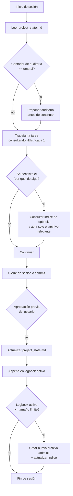

# logsayer — Especificación maestra

CLI open source, agnóstico de agente, que extiende el patrón spec-driven (tipo GitHub Spec Kit) con 3 capas que ese patrón no resuelve: continuidad de estado entre sesiones, bitácora histórica particionable, y verificación continua (mecánica + semántica) de que el código sigue siendo lo que la especificación dice.

Este documento reemplaza y consolida: la arquitectura genérica de capas, el plan de fases del CLI, el tema narrativo Dune, la clasificación bot/subagente, la estrategia multi-agente, los riesgos conocidos de diseño, y los umbrales de configuración — es la única fuente de verdad a partir de ahora.

---

## 1. Nombre y posicionamiento

- **Nombre:** `logsayer` — portmanteau de "log" (continuidad/bitácora) + "sayer" (de Truthsayer, verificación). Verificado libre en PyPI y GitHub.
- **Mensaje de una línea:** *Spec Kit te dice qué construir. logsayer te dice dónde estás parado, cómo llegaste, y si lo que construiste sigue siendo lo que dijiste que ibas a construir.*
- **Diferencial:** Spec Kit gobierna la primera generación de código; después, su autoridad sobre el código es por convención, no por verificación. logsayer agrega el verification loop que falta, más continuidad de contexto entre sesiones.

---

## 2. Las 5 capas

| # | Capa | Pregunta que responde | Personaje | Tipo | Quién escribe | Cuándo se lee | Presupuesto |
|---|---|---|---|---|---|---|---|
| **1** | **Especificación** (normativa) | ¿Qué hay que construir? | **Mentat** | Subagente | Vos + agente, revisado por vos | Solo al trabajar esa HU puntual | Sin límite — granular por HU |
| **2** | **Estado** (ancla) | ¿Dónde está el proyecto ahora? | **Navegante de la Cofradía** | Subagente liviano | El agente, al cerrar sesión, con tu aprobación | Al inicio de cada sesión, obligatorio | Bajo — pocos miles de tokens |
| **3** | **Bitácora** (histórica) | ¿Cómo llegamos hasta acá y por qué? | **Reverenda Madre** (Otra Memoria) | Subagente | El agente, append-only, con tu aprobación | Bajo demanda, vía índice | Particionado — 400 líneas por archivo |
| **4** | **Verificación** | ¿Lo construido sigue siendo lo especificado? | **Suk Doctor** (mecánica) + **Decidora de Verdad** (semántica) | Bot + Subagente | Bot: automático. Subagente: por contador, con aprobación | Suk: cada sesión/commit. Decidora: por umbral de HUs | Bajo — resultados en `06_audits/` |
| **5** | **Proceso** (operativa) | ¿Cómo se trabaja acá? | **Fremen** | Bot (mayormente) | Vos, rara vez cambia | Al inicio de sesión, una vez | Bajo — reglas fijas |

**Regla de oro:** cada documento vive en una sola capa. Si una decisión de arquitectura termina en el snapshot de estado, o un dato del presente termina en la bitácora, la separación se rompe.

**Bot vs. Subagente:** un bot es determinístico (mismo input → mismo output, sin razonamiento — tests, linters, checklists objetivos). Un subagente tiene contexto propio aislado, system prompt específico y herramientas restringidas — se usa cuando la tarea requiere juicio (qué loguear, si el código cumple el spec). En la práctica, cada subagente es un archivo real de markdown con su propio scope de lectura/escritura: la convención estándar de `AGENTS.md` los ubica en `.agents/<rol>/AGENTS.md`, y cada agente tiene su variante (opencode: `.opencode/agent/`, Claude Code: `.claude/agents/`, etc.). Esto impone el principio de single-writer-por-capa a nivel de permisos, no de disciplina manual.

---

## 3. Estructura de directorios

```
proyecto/
├── inbox/                          # punto de entrada de Capa 1 — NO es una capa
│   └── .gitignore                  # ignora su contenido: lo que entra no se versiona
└── docs/
    ├── project_state.md            # Capa 2 — Estado (Navegante)
    ├── logbooks/                   # Capa 3 — Bitácora (Reverenda Madre)
    │   ├── 00_index.md
    │   ├── logbook_<fase>_01.md
    │   └── logbook_<fase>_02.md
    ├── 01_global/                  # Capa 1 — visión, alcance, reglas de negocio
    ├── 02_technical/               # Capa 1 — decisiones técnicas, modelos, diagramas
    ├── 03_process/                 # Capa 5 — DoR, checklist de merge (Fremen)
    ├── 04_user_stories/            # Capa 1 — HU-01..HU-N
    │   └── HU-01/
    ├── 05_agile_methodology/       # Capa 5 — metodología de trabajo con IA
    └── 06_audits/                  # Capa 4 — Suk Doctor + Decidora de Verdad
```

**Lenguaje de la estructura:** los nombres de carpetas y archivos van en inglés — es la superficie pública del framework: paths que invocan los adaptadores por agente y que ven usuarios de cualquier idioma. El contenido de los documentos puede estar en cualquier idioma (por defecto, el framework genera contenido en español). Los prefijos numéricos (`01_`...) son agnósticos de idioma.

**`inbox/` — punto de entrada, no capa.** La banda de entrada vive en la raíz, **fuera de `docs/`**: cualquier `.md` dentro de `docs/` que no pertenezca a una capa dispara `capas_mezcladas` (§13.4.1), así que una bandeja adentro se autovería. No es una capa: no se lee al iniciar sesión, no se versiona (su `.gitignore` propio lo declara, sin tocar el `.gitignore` del proyecto), y su única salida es entrar a Capa 1.

Cubre el caso que el flujo de sesión (§7) no resuelve: llega un documento de otro equipo y hay que decidir a qué capa va. El flujo es siempre el mismo: el CLI mueve y nombra (`inbox add` → `doc route` → `doc new`), el subagente **Mentat** deriva el contenido y decide la capa. Al crear el documento derivado con `--from`, el original se mueve a `inbox/_done/` y su procedencia queda registrada en el bloque `## Fuente` del documento — que por eso es obligatorio, no decorativo.

**El CLI propone, no decide.** `doc route <archivo>` solo clasifica cuando la señal es inequívoca: extensión no markdown (va a la bandeja) o una HU declarada en el nombre. En cualquier otro caso devuelve las filas candidatas y una pista opcional, y la elección la hace Mentat. No existe default a `02_technical/`: un `.md` suelto que en realidad es visión de producto terminaría en la carpeta técnica, que es exactamente el error que este flujo evita (spec §10). Si el nombre choca con un documento de Capa 1 que ya existe, avisa que no duplique en vez de crear un segundo.

---

## 4. Umbrales de configuración (`logsayer.toml`)

```toml
[logsayer]
session_close_context_threshold = 0.70   # % de contexto usado → proponer cierre de sesión
bitacora_max_lines = 400                 # líneas por archivo atómico antes de particionar
audit_threshold_hus = 3                  # HUs cerradas desde última auditoría → disparar audit
inbox_max_age_days = 14                 # días sin ubicar en inbox/ → avisar que la bandeja envejece
```

| Umbral | Unidad | Por qué esa unidad |
|---|---|---|
| Cierre de sesión | % de contexto usado (Navegante) | Señal real expuesta por los CLIs de agente (p. ej. `/context` en opencode y Claude Code); alineado con degradación de precisión reportada pasados ~32k tokens |
| Partición de bitácora | Líneas/tokens del archivo (Reverenda Madre) | El costo lo paga la sesión futura que lo lee, no la sesión actual — no depende del % de uso de hoy |
| Auditoría | HUs cerradas (Decidora de Verdad) | Progreso del proyecto, no de la sesión — evita auditar sesiones de debugging que no cerraron nada |
| Antigüedad en `inbox/` | Días sin ser ubicado (Suk Doctor) | Un documento que nadie ubica deja de ser información y pasa a ser ruido: el costo lo paga el proyecto entero, no una sesión. Días, no líneas ni % de contexto, porque lo que envejece es la *vigencia* del documento externo frente al estado actual, no su volumen |

### Presets de proyecto (`init --preset <nombre>`, fase 7)

Un preset es un **bundle de convenciones** con dos ejes: qué adaptadores deja declarados y qué umbrales pone. Se materializa una sola vez, en `init`; a partir de ahí el proyecto se gobierna con su propio `logsayer.toml`.

```toml
[project]
preset = "minimal"   # qué preset originó este archivo — informativo, lo vigila el check preset_conocido

[adapters]
enabled = ["claude"]   # qué adaptadores declara el preset; el que los genera es `agent add`
```

**La forma del archivo no se mueve.** Los cuatro umbrales siguen en `[logsayer]` con las mismas claves: cambiar el nombre de la tabla rompería en silencio todo proyecto ya scaffoldeado, porque `LogsayerConfig.load()` no distingue "falta la tabla" de "no hay configuración" y volvería a los defaults — el peor modo de falla posible para un framework de umbrales. `[project]` y `[adapters]` son bloques nuevos que conviven con el viejo, y el umbral no se toca.

**Precedencia, y es más chica de lo que parece:** `--preset` elige el preset; cada clave que el preset declara sobreescribe el default del `dataclass`, y las que omite caen al default. No hay un tercer escalón porque `init` no expone banderas de umbral, y la que sería natural —el idioma del contenido— no es del framework (§10). El preset `default` es entonces literalmente "no sobreescribir nada", que es lo que lo hace el baseline de los tests.

**El preset es un snapshot, no una herencia viva.** `init` copia los valores al `logsayer.toml` y el preset deja de existir para ese proyecto. Así no hay que resolver "qué pasa si el preset cambia en la próxima versión", y el usuario edita el TOML sin sorpresas. El precio es que actualizar logsayer no actualiza los umbrales de un proyecto ya scaffoldeado: ver el riesgo en §10.

**Los presets son datos, no código**: TOML dentro del paquete (`src/logsayer/presets/<nombre>.toml`), leídos con `importlib.resources`. Cada uno se valida en los tests contra el mismo `LogsayerConfig` que lee el TOML del proyecto, así que un preset roto no puede llegar al scaffold. Agregar un preset no toca lógica.

**Se distributionan dos.** `default` (comportamiento de hoy: umbrales actuales, `enabled` vacío) y `minimal` (un solo adaptador, umbrales más laxos, para probar la herramienta o proyectos chicos). `strict` —todos los adaptadores y umbrales exigentes— queda fuera, y el motivo queda escrito: un preset sin caso real es superficie para mantener. Tampoco entran los presets por lenguaje o framework, los presets definidos por el usuario ni la composición (`--preset a,b`): eso son las "más agentes según demanda" de la fila 7 del roadmap, y se agregan cuando alguien los pida.

**Dos checks hacen legales las dos claves nuevas** (D13: un valor entra solo si un comando lo consume mecánicamente). `preset_conocido`, `warn` unidireccional cuando el preset declarado **no existe en el paquete instalado**, que es el fallo real de un snapshot. `adaptadores_declarados`, `warn` cuando un nombre de `enabled` no está en `SUPPORTED` —o cuando sí, pero los archivos del adaptador no existen en el proyecto, que es la distancia entre declararlo y ejecutar `agent add`. Ninguno de los dos corrige: avisan, que es lo que hace el resto del CLI.

---

## 5. Comandos (con alias plano)

```
logsayer init <project-name> [--preset <nombre>]  # scaffoldea docs/ + config + AGENTS.md
logsayer init --here                        # scaffoldea en el proyecto existente, en la raíz

logsayer agent add <opencode|claude|copilot|cursor|gemini|hermes>   # opencode, claude y copilot implementados; el resto responde "aún no implementado"

logsayer mentat spec new <hu>               # alias: logsayer spec new
logsayer navigator state show               # alias: logsayer state show
logsayer navigator memory index             # alias: logsayer memory index
logsayer navigator memory status            # alias: logsayer memory status
logsayer reverend-mother log add "…"        # alias: logsayer log add
logsayer reverend-mother log index          # alias: logsayer log index
logsayer inbox                              # lista lo pendiente en la bandeja
logsayer inbox add <archivo>                # mueve un documento externo a inbox/
logsayer mentat doc route [<archivo>]       # alias: logsayer doc route  (propone, no decide)
logsayer mentat doc new <capa> <nombre>     # alias: logsayer doc new  (--from <archivo>)
logsayer suk doctor                         # alias: logsayer check
logsayer truthsayer audit run               # alias: logsayer audit run
logsayer truthsayer audit status            # alias: logsayer audit status
logsayer fremen verify                      # alias: logsayer process check
```

**`init` no genera adaptadores.** Con `--preset`, el preset declara cuáles van en `[adapters] enabled` del `logsayer.toml`; ejecutarlos sigue siendo `logsayer agent add <agente>`, el único comando que escribe archivos de adaptador. La frontera es deliberada: `generate_adapters()` pisa lo que encuentra sin preguntar, así que si `init` generara adaptadores, `init --here` rompería su propia promesa de no sobrescribir lo que ya está (D4) y podría pisar subagentes que el usuario editó. Lo que reconcilia declaración y ejecución es el check `adaptadores_declarados` (§4), no `init`. En modo adopt, si el `logsayer.toml` ya existe, `--preset` no se aplica y `init` lo avisa: el TOML del proyecto manda, y aplicar el preset a medias sería peor que no aplicarlo.

**Superficie de ingreso de documentos (Capa 1).** `inbox` a secas lista lo que está esperando ubicación; `inbox add` es el único comando que toca archivos del usuario: mueve el archivo que el humano le señaló a `inbox/` y nada más. `doc route` imprime la tabla de decisión (entrada → capa → destino → ¿se versiona?) sin escribir nada; con argumento devuelve los candidatos para ese archivo, y decide solo con señal inequívoca (§3). `doc new <capa> <nombre>` scaffoldea un documento de Capa 1 con el header estándar; las capas aceptadas son `global` (`docs/01_global/`) y `technical` (`docs/02_technical/`) — para una HU puntual el comando es `spec new <HU>`, que ya existe, y la tabla de ruteo lo indica. Con `--from <archivo>` deja el bloque `## Fuente` completo y mueve el original a `inbox/_done/`.

Ninguno de estos comandos redacta contenido de Capa 1 a partir del archivo: el CLI nombra y ubica, el subagente Mentat deriva (spec §6). El CLI tampoco convierte PDF ni docx — avisa que hay que hacerlo antes, como paso previo y fuera del framework.

**Índice de memoria (capa transversal, no una sexta capa).** `memory index` regenera `docs/00_memory_index.md`, una línea por documento de `docs/`, a partir de la ruta (nivel), del header estándar (fecha · estado) y del frontmatter `tags`; si el documento no declara tags, se derivan del nombre y de la HU citada en `## Fuente`. El índice es un artefacto: se regenera, no se edita a mano. `memory status` informa qué indexa y con cuántas tags — no dictamina frescura, eso es el check `indice_al_dia`. `memory search "<consulta>"` es el retrieval: tokeniza la consulta, la intersecta con las tags del índice, ordena y corta (`--capa` acota a una capa, `--limit` al tope de candidatos; `0` = todos). El ranking son las tags —el acierto exacto pesa más que el prefijo compartido— y a igualdad de puntaje manda el nivel más cercano a la especificación y después la ruta, que es el mismo orden con el que se lee el índice. El retriever **lee el artefacto, no los documentos**: si regenerara o leyera del disco, la frescura no tendría nada que verificar. La frescura la vigila `indice_al_dia`, check de Fremen (Capa 5) que compara el índice contra la fecha de versión de los documentos de Capa 1 —el máximo entre `git log -1` y el mtime— y avisa con `warn` nombrando el más nuevo, nunca con `fail`. Diseño completo en la fase 8 del roadmap.

---

## 6. Estrategia multi-agente

Un único motor (`logsayer/core/`) + un adaptador por agente (`logsayer/adapters/<agente>/`) que solo traduce el formato de comando nativo de cada herramienta:

- **Estándar `AGENTS.md`** → `.agents/*` (punto de coordinación universal: opencode, Claude Code, Copilot, Cursor, Gemini CLI, Windsurf y el resto)
- **opencode** → reglas y subagentes bajo `.opencode/`
- **Claude Code** → slash commands en `.claude/commands/` y subagentes en `.claude/agents/`
- **GitHub Copilot** → perfiles en `.github/agents/<rol>.agent.md` e instrucciones de path en `.github/instructions/logsayer/<rol>.instructions.md` (ocho archivos: dos por rol)
- **Cursor** → `.cursor/commands/` o reglas equivalentes
- **Hermes / Gemini CLI** → sus convenciones respectivas

**Principio de diseño clave:** la lógica vive en el CLI, no en los archivos de comando por agente. Los archivos que se generan para cada agente son wrappers finos que llaman al CLI (`logsayer log add "…"`), igual que hace Spec Kit con sus `speckit.*` — así se agrega un agente nuevo sin duplicar lógica.

**La superficie declarativa de permisos no es la misma en todos los agentes, y el CLI no la iguala a la fuerza.** El single-writer por capa se declara con la unidad que cada herramienta soporta:

- **opencode**: el bloque `permissions:` del subagente evalúa reglas ordenadas por `action` + `resource` + `effect`. El orden importa: `edit: * deny` tiene que preceder a los `shell … allow`, o la denegación general se come las excepciones. Es el único adaptador donde el alcance por ruta y por comando es una declaración.
- **Claude Code**: el frontmatter de subagente solo expone `tools` (allowlist de **nombres de herramienta**) y `disallowedTools`. La granularidad es la herramienta, no el recurso: no hay `Edit(<ruta>)` ni `Bash(<comando>)` por subagente. Las reglas por recurso existen en `permissions.allow/ask/deny` de `settings.json`, pero son **de sesión** —alcanzarían a la sesión principal y a los otros roles por igual—, así que logsayer **no las genera**: un archivo de permisos que no se puede acotar al subagente no declara lo que parece declarar. En este adaptador el alcance por ruta queda en el prompt y en las reglas de la sesión, y el template lo dice en vez de dejar que la prosa parezca una garantía.

El criterio que se sigue al agregar un adaptador es no escribir un campo de permiso que la herramienta pueda ignorar en silencio: un campo no aplicado se lee como una garantía y opera como una ausencia. Ver `docs/04_user_stories/HU-14/README.md`.

- **Copilot**: separa las dos mitades que los otros adaptadores resuelven en un archivo. El perfil (`.github/agents/<rol>.agent.md`) declara `description` y `tools` con los alias canónicos de la herramienta (`read`, `search`, `edit`, `execute`, …); la instrucción (`.github/instructions/logsayer/<rol>.instructions.md`) declara `applyTo` y `excludeAgent`. El alcance por ruta existe, pero **es filtro de contexto, no permiso**: `applyTo` decide dónde se inyecta la instrucción y no qué puede escribir el rol (D38). Por eso este adaptador escribe la escritura única por capa en la prosa de cada template, como el de Claude Code, y no en un campo. No se emite `target` (sin valor sirve para GitHub.com y para el IDE; fijarlo reduce el alcance), ni `argument-hint`/`handoffs` (la documentación los declara ignorados), ni `infer` (retirada). Los ocho archivos llevan `excludeAgent: "code-review"`, porque los roles no existen en una sesión de code review (D39). Copilot lee `AGENTS.md` nativamente, así que **no** se genera `.github/copilot-instructions.md`: sería una segunda fuente de verdad para lo mismo (D37).

---

## 7. Flujo de sesión y disparadores


```mermaid
flowchart TD
    A[Inicio de sesión] --> B[Leer project_state.md]
    B --> C{Contador de auditoría<br/>>= umbral?}
    C -- sí --> D[Proponer auditoría<br/>antes de continuar]
    C -- no --> E[Trabajar la tarea<br/>consultando HUs / capa 1]
    D --> E
    E --> F{Se necesita el<br/>'por qué' de algo?}
    F -- sí --> G[Consultar índice de logbooks<br/>y abrir solo el archivo relevante]
    F -- no --> H[Continuar]
    G --> H
    H --> I[Cierre de sesión o commit]
    I --> J{Aprobación previa<br/>del usuario}
    J -- ok --> K[Actualizar project_state.md]
    K --> L[Append en logbook activo]
    L --> M{Logbook activo<br/>>= tamaño límite?}
    M -- sí --> N[Crear nuevo archivo atómico<br/>+ actualizar índice]
    M -- no --> O[Fin de sesión]
    N --> O
```

**Los 5 momentos del flujo:**

1. **Apertura de sesión** — el agente lee *solo* la capa de estado (no la bitácora completa, no todas las HUs). Barato en tokens, contexto suficiente para orientarse.
2. **Chequeo de auditoría** — si el contador supera el umbral, el agente lo propone activamente en vez de esperar que vos te acuerdes.
3. **Trabajo** — el agente consulta la capa de especificación (HU puntual) para saber qué construir, y solo abre la bitácora si necesita contexto histórico de una decisión concreta.
4. **Cierre / commit** — con tu aprobación previa, el agente actualiza estado (sobrescribe) y bitácora (append).
5. **Partición automática** — si el logbook activo supera el límite de tamaño, se crea uno nuevo y se actualiza el índice maestro; la fase determina el prefijo, el tamaño determina el corte dentro de la fase.

**Tabla de disparadores (triggers):**

| Evento | Capa afectada | Acción | Requiere aprobación |
|---|---|---|---|
| Inicio de sesión | Estado | Lectura obligatoria de `project_state.md` | No |
| Inicio de sesión | Verificación | `logsayer check` — la sesión arranca con el diagnóstico mecánico, que también reporta si hay documentos sin ubicar en `inbox/` | No |
| Inicio de sesión (contador alto) | Verificación | Proponer auditoría | Sí, para ejecutarla |
| Cierre de sesión / commit | Estado | Actualizar snapshot | Sí |
| Cierre de sesión / commit | Bitácora | Append entrada en el logbook activo | Sí |
| Logbook activo llena | Bitácora | Crear archivo atómico + actualizar índice | No (mecánico) |
| Decisión de arquitectura nueva | Especificación | Editar `02_technical/` | Sí |
| Documento externo en `inbox/` | Especificación | `check` lo reporta; el agente anfitrión se lo delega al subagente Mentat, que decide la capa con `doc route` y crea el documento con `doc new` | Sí, para escribir el documento derivado |
| ≥ N HUs cerradas | Verificación | Ejecutar auditoría HU-vs-código | Sí |

---

## 8. AGENTS.md — plantilla coordinadora

```markdown
# AGENTS.md — logsayer

## Al iniciar sesión
1. Leer docs/project_state.md (obligatorio, siempre).
2. Correr logsayer check (mecánico, barato, y reporta
   documentos sin ubicar en inbox/).
3. Verificar contador de auditoría. Si >= 3 HUs, proponer
   auditoría (Decidora de Verdad) antes de tomar tarea nueva.
4. NO leer logbooks/ completa — solo docs/logbooks/00_index.md
   bajo demanda.

## Durante la sesión
- Si el uso de contexto supera 70%, proponer cierre de sesión antes
  de tomar más tareas nuevas.
- Trabajar cada HU leyendo solo su carpeta en 04_user_stories/.
- Decisión de arquitectura nueva → candidata a entrada de logbook,
  nunca se escribe directo en el estado.

## Documentos entrantes (inbox/)
- Si logsayer check lista archivos en inbox/, delegar al subagente
  Mentat: él decide la capa (logsayer doc route) y crea el documento
  (logsayer doc new). No derivar el contenido en el estado.
- Si el humano entrega un documento que NO es del proyecto (entrega,
  contrato, acta), no ubicarlo a mano:logsayer inbox add <archivo>.
  No mover archivos del proyecto ni código.
- El CLI no redacta contenido de Capa 1 desde el archivo: mueve y
  nombra; el Mentat deriva.

## Al cerrar sesión o commit (requiere aprobación previa)
- Actualizar project_state.md (snapshot, no acumulativo).
- Append en logbooks/logbook_<fase>_NN.md activo.
- Si supera 400 líneas, crear NN+1 y actualizar 00_index.md.
- Si se cerró una HU, incrementar contador de auditoría.

## Auditoría (Decidora de Verdad)
- Disparador: contador >= 3 HUs cerradas.
- Compara 04_user_stories/ vs código real.
- Resultado en 06_audits/audit_<fecha>.md.
- Resetea el contador tras aprobación.
```


---

## 9. Roadmap

| Fase | Contenido |
|---|---|
| **0 — Definición** | Nombre (✅ `logsayer`), manifiesto, `logsayer.toml` schema |
| **1 — MVP** | `init` scaffoldea `docs/` + `AGENTS.md`, sin multi-agente |
| **2 — Comandos core** | `spec new`, `log add` + partición automática, `log index`, `audit run`, `audit status` |
| **3 — Adaptadores multi-agente** | opencode y Claude Code primero (entorno propio), luego los demás por demanda — cada adaptador es un wrapper fino al motor único |
| **4 — Validación** | `doctor`/`check`, detección de capas mezcladas |
| **5 — Documentación y publicación** | README con disclaimer, PyPI, MIT, casos de ejemplo |
| **6 — Ingreso de documentos** | `inbox/` + `inbox add`, `doc route`, `doc new` con header estándar, check `bandeja_entrada`, Routing table en README |
| **7 — Comunidad** | Presets de proyecto (`init --preset`): `default` y `minimal`, como TOML dentro del paquete y con la regla de snapshot (§4). **Cerrada** (HU-18): la implementación, los dos checks que hacen legales las claves nuevas (`preset_conocido`, `adaptadores_declarados`) y D41. Más agentes por demanda |

---

## 10. Riesgos conocidos de diseño

- **No repetir el "sea of markdown" de Spec Kit**: cada comando debe generar lo mínimo indispensable, no documentos de cientos de líneas por defecto. El límite de tamaño del logbook ya está definido — aplicar el mismo criterio a los templates de HU.
- **`inbox/` puede volverse un cajón de sastre**: una staging area que nadie procesa es peor que no tenerla, porque aparenta estar ordenada. Dos contramedidas ya incluidas: no se versiona (no es un lugar donde buscar información) y `check` avisa cuando un documento lleva más de `inbox_max_age_days` sin ser ubicado. El umbral es un aviso, no un borrado — borrar archivos del usuario nunca es responsabilidad del CLI.
- **La detección de "documentos huérfanos" por mención no es mecánica**: el estado es prosa libre, así que un check que busca "el nombre del doc aparece en el estado o en un logbook" produce falsos positivos permanentes en `01_global/` (visión, alcance — nunca se citan) y deja de ser determinista, que es la promesa de un bot. La coherencia entre Capa 1 y Capa 2 es trabajo de la Decidora (§13.4.2), no de Suk.
- **Determinismo del audit**: como la auditoría HU-vs-código la hace un subagente (no el CLI directamente), el resultado depende del agente que la ejecute. El CLI debe generar la estructura del reporte y el prompt de auditoría, no prometer resultado determinístico — ser honesto sobre esto en la documentación.
- **No mezclar capas en el propio código del CLI**: la tentación de meter lógica de negocio del framework dentro de `AGENTS.md` generado (en vez de dejarla en el core del CLI) rompe el principio de single source of truth.
- **Un preset snapshot se desactualiza y el usuario puede no enterarse**: al actualizar logsayer, un proyecto scaffoldeado con `--preset minimal` **no** recibe los valores nuevos del preset, porque `init` los copió una vez. Es el precio de que el TOML sea editable y sin sorpresas, y se asume a conciencia: la alternativa —herencia viva— obligaría a resolver "qué pasa si el preset cambia", que es un problema de migraciones. Se paga de dos formas, ambas mecánicas: el aviso vive en el propio TOML (`[project] preset` es informativo a propósito) y el check `preset_conocido` avisa con `warn` cuando el preset declarado ya no existe en el paquete instalado, nombrando la versión para que se sepa de cuándo quedó.
- **El idioma del contenido no es del framework**: los 17 templates están en español y no hay bandera de idioma en ninguna parte. Meterla como eje del preset parece una línea de configuración y es i18n de toda la superficie generada, con los 8 templates de adaptadores incluidos, que además cambian de forma entre opencode y Claude Code. Queda fuera de la v1: el idioma del contenido es una decisión de proyecto, y el propio `AGENTS.md` generado ya lo dice — la superficie pública va en inglés, el contenido generado puede ir en el idioma del proyecto. Si alguna vez entra, entra como fase propia y no como clave más del preset.

---

## 11. Stack técnico

Python 3.11+ · Typer (CLI) · Jinja2 (templates) · TOML (config) · distribución PyPI vía `uv tool install` / `pipx` · empaquetado con `pyproject.toml` + `hatchling`.

---

## 12. Disclaimer de homenaje (obligatorio en README público)

> Este proyecto usa nombres y conceptos de la saga *Dune* de Frank Herbert exclusivamente como referencia temática y metáfora de rol. No implica afiliación, patrocinio ni asociación oficial con Herbert Properties LLC, Legendary Entertainment, ni titulares de derechos de la franquicia. No se reproduce arte, logos ni material protegido — solo nombres de conceptos/roles como analogía de diseño.

---

## 13. Apéndice — Lore Dune de los roles

> Aplica el disclaimer de la sección 12. Este apéndice es referencia narrativa: la fuente de verdad de comandos, capas y umbrales es el cuerpo de esta especificación, no este apéndice.

**Premisa:** tras el Jihad Butleriano, la humanidad prohíbe las "máquinas pensantes" — cualquier IA capaz de razonar o recordar por sí misma. La respuesta fue desarrollar capacidades humanas especializadas y externas para cada función. Es, casi literalmente, el problema de un agente de IA moderno operando sin memoria persistente entre sesiones: sin "máquina pensante" que recuerde por sí sola, el sistema compensa con capas externas especializadas.

### 1. 🧮 Mentat — Capa de Especificación

**Rol canon:** computadoras humanas entrenadas en cálculo, análisis, estrategia y procesamiento de información — la respuesta de la humanidad a la prohibición del pensamiento artificial.

**Rol en el framework:** define *qué* se construye y *cómo se valida*. Contiene historias de usuario, casos de uso, modelos de datos, decisiones técnicas y reglas de negocio. Es la capa normativa — el contrato de comportamiento del sistema. También es quien deriva el contenido de los documentos que llegan por `inbox/` (spec §3).

**Comandos:** `logsayer mentat spec new <hu>` · alias `logsayer spec new` — `logsayer mentat doc route [<archivo>]` · alias `logsayer doc route` — `logsayer mentat doc new <capa> <nombre>` · alias `logsayer doc new`

---

### 2. 🧭 Navegante de la Cofradía — Capa de Estado

**Rol canon:** mutados por exposición prolongada a la especia melange, usan presciencia limitada para ver el camino seguro *inmediato* a través del plegado espacial. No predicen todo el futuro — resuelven "¿por dónde se puede avanzar ahora sin chocar?".

**Rol en el framework:** snapshot del presente del proyecto. Es lo primero que se lee al iniciar sesión — contexto suficiente para orientarse sin releer todo el historial.

**Comando:** `logsayer navigator state show` · alias `logsayer state show`

---

### 3. 🕯️ Reverenda Madre (Bene Gesserit) — Capa de Bitácora

**Rol canon:** portadoras de la **Otra Memoria** — conciencia y recuerdos de generaciones de Reverendas Madres anteriores, transmitida y accesible por cada nueva iniciada sin que tenga que vivir esa historia de cero.

**Rol en el framework:** historial cronológico append-only de decisiones. Memoria episódica: qué pasó, cuándo y por qué, particionada cuando crece demasiado para seguir siendo consultable.

**Comando:** `logsayer reverend-mother log add "…"` · alias `logsayer log add`

---

### 4. Verificación — Capa 4 (dos roles)

Es **una sola capa** con dos roles complementarios: el mecánico diagnostica síntomas medibles; el semántico detecta engaño. Juntos responden: *¿lo construido sigue siendo lo especificado?*

#### ⚕️ Suk Doctor — Verificación (mecánica)

**Rol canon:** médicos de la Escuela Suk, con condicionamiento imperial que garantiza objetividad absoluta — diagnóstico protocolizado, basado en síntomas medibles, sin intervención de juicio subjetivo.

**Rol en el framework:** chequeo estructural automatizado — tests, linters, validación de que la estructura de carpetas y capas no se mezcló. Detecta si el "paciente" (el proyecto) está sano según parámetros objetivos y medibles. Es también el canal por el que el proyecto se entera de que hay documentos sin ubicar en `inbox/`: ese reporte es un `warn`, no un `fail`, porque una bandeja con pendientes es un proyecto sano con un pendiente, no un paciente enfermo.

**Comandos:** `logsayer suk doctor` · alias `logsayer check`

**Chequeos determinísticos (D7):**
- `marcadores_raiz`, `estructura_capas`, `estado_capa2`, `bitacora_indice`, `hus_ubicacion`, `capas_mezcladas`, `header_capa1`, `bandeja_entrada`, `estado_al_dia`, `auditoria_completa`, `contador_hus_al_dia`, `preset_conocido` y `adaptadores_declarados`. Todos `ok|warn`, y solo `fail` corta el flujo. `contador_hus_al_dia` compara el contador declarado en el snapshot contra el derivado del disco sobre el reporte sellado, avisando en `warn` **solo** cuando lo declarado subestima (nunca falla). `preset_conocido` avisa cuando el preset declarado ya no existe en el paquete instalado, que es el fallo real de un snapshot, y nombra la versión; `adaptadores_declarados` avisa cuando un nombre de `[adapters] enabled` no tiene adaptador o tiene uno cuyos archivos no están en el proyecto — se mide contra el conjunto entero, no archivo por archivo (D41).

#### 👁️ Decidora de Verdad (Bene Gesserit) — Verificación (semántica)

**Rol canon:** una Reverenda Madre con el don específico de detectar mentira — incluso cuando quien habla cree estar diciendo la verdad. No diagnostica síntomas: diagnostica engaño.

**Rol en el framework:** auditoría spec-vs-código real. Es la defensa contra la "alucinación" del agente: el código puede pasar todos los tests (Suk Doctor conforme) y aun así no implementar lo que el spec dice. La Decidora compara lo dicho contra lo real.

**Comando:** `logsayer truthsayer audit run` · alias `logsayer audit run`

---

### 5. 🏜️ Fremen — Capa de Proceso

**Rol canon:** cultura del desierto de Arrakis, regida por disciplina extrema y protocolo no negociable de supervivencia (la disciplina del agua, los ritos, las reglas del sietch).

**Rol en el framework:** reglas operativas fijas — Definition of Ready, checklist de merge, metodología de trabajo. No cambian sesión a sesión; son el protocolo que no se renegocia.

**Comando:** `logsayer fremen verify` · alias `logsayer process check`

---

**Nota de diseño:** el alias plano en cada comando no es decorativo: quien use el framework sin conocer Dune tiene que poder operarlo con total fluidez solo con los aliases. El lore suma identidad y hace memorable la documentación, pero nunca debe ser la única puerta de entrada a la funcionalidad.

---

## 14. Próximo paso concreto

Fase 6 — Ingreso de documentos (**cerrada**): `inbox/` + `inbox add`, tabla de ruteo en `core/routing.py` expuesta por `doc route`, `doc new` con header estándar, check `bandeja_entrada` y la sección "Documentos entrantes" en el `AGENTS.md` generado. Ver `docs/04_user_stories/HU-06/` a HU-09 para el desglose y los criterios de aceptación.

Fase 8 — Memoria seleccionable (**cerrada**): índice generado sobre `docs/` (`logsayer memory index`), contrato de frontmatter reducido a `tags` (D13) y retrieval determinista (`logsayer memory search`) con el check de frescura `indice_al_dia` en Fremen. El grafo es capa transversal de navegación, no una sexta capa (D12); el retrieval ordena la lectura pero nunca recorta el alcance de la auditoría (D14). Diseño en `docs/02_technical/memory_architecture.md`; desglose en HU-10 (índice) y HU-11 (retrieval).

Fase 9 — Auditoría por pasada (**cerrada**): el alcance de la auditoría deja de ser una promesa en el prompt y pasa a ser un artefacto. `logsayer audit run` scaffoldea una tabla con una fila por HU contada en el disco (D20), la Decidora audita cada HU en una pasada acotada a su input, y una síntesis final lee solo la tabla de veredictos y solo si alguno cambió (D23). El check `auditoria_completa` avisa en `warn` si alguna fila quedó vacía, y `logsayer audit run --hu HU-XX` reemite el brief de una pasada sin tocar el alcance (D22). `docs/project_state.md` no invalida la herencia de una HU porque se reescribe en cada cierre de sesión (D21). Diseño en `docs/02_technical/audit_protocol.md`; desglose en HU-12 (alcance) y HU-13 (pasada y síntesis). Origen: la auditoría del 2026-09-27 cubrió 4 de 11 HUs sin que nada lo señalara.

Release cortado: **0.7.0 = fase 6**, con el tag `v0.7.0` en `087a482` (el merge de la auditoría del 2026-09-28: último commit antes de que el diseño de la fase 8 entre a `develop`), publicado el 2026-09-30; y **0.8.0 = fases 8 y 9**, que es lo que sigue. La fase 6 se integró en `develop` el 2026-09-25 (`db35a63`), que es la fecha que declara el changelog para 0.7.0. Verificado en el paquete publicado: expone `inbox` y `doc` y no expone `memory`. Lo previo en PyPI era 0.6.0 (2026-09-25).

Fase 7 — Comunidad (**cerrada**, HU-18): `init --preset <nombre>` resuelve un bundle de convenciones y lo materializa una vez en `logsayer.toml`. El preset es un **snapshot, no una herencia viva**: `init` copia los valores y el preset deja de existir para ese proyecto, así que no hay que resolver "qué pasa si el preset cambia en la próxima versión" y el TOML se edita sin sorpresas. Se distributionan `default` y `minimal`, como TOML dentro del paquete y no como código. `init` **no** genera adaptadores: los declara en `[adapters] enabled` y los escribe `agent add`, porque `generate_adapters()` pisa sin preguntar y `init --here` no puede pisar lo que ya está (D4); lo que reconcilia la distancia entre declarar y ejecutar son los checks `preset_conocido` y `adaptadores_declarados`. Los umbrales se quedan en `[logsayer]` y no se mueven (§4). El idioma del contenido **no** es eje del preset: detrás hay i18n de los 25 templates y no hay bandera hoy (§10). Diseño completo en §4. Lo que la implementación añadió fue **D41**: `adaptadores_declarados` mide contra el conjunto de archivos del adaptador y no archivo por archivo, porque quien escribió uno a mano ya ejecutó la parte y un archivo borrado a conciencia no es un pendiente — medirlo archivo por archivo produciría un aviso permanente en cada proyecto que depure un subagente. Ver `docs/04_user_stories/HU-18/README.md`.

Publicación automatizada: la batería (`python -m pytest -q`, `ruff check src tests`, `mypy src`) corre en cada PR a `develop` sobre 3.11, 3.12 y 3.13 — las tres versiones que declara `requires-python` —, y un tag semver dispara el job que construye y publica en PyPI. Ese job se corta si el tag no declara la versión de `pyproject.toml` y la de `__version__`: el tag y el contenido tienen que decir lo mismo (D11). El token de PyPI viaja por variable de entorno (`UV_PUBLISH_TOKEN`) y vive en el secreto del repo, nunca en el código. `v0.7.0` salió a mano, desde una shell, y es el último que se publica así.

Fase 3 — Capa de coordinación (**cerrada**): motor único en `core/` + un adaptador delgado por herramienta. Cerró con Copilot (D26 lo decidió así: uno solo, no los cuatro que el registro enumeraba), que fue también el caso difícil — su convención parte el rol en dos archivos, perfil e instrucción de path (D36), su superficie declarativa es de herramientas y no de permisos (D38), y `AGENTS.md` ya cubre lo transversal, así que no hay un `.github/copilot-instructions.md` que mantener en paralelo (D37). Los tres adaptadores invocan los mismos comandos de Mentat; lo que no se puede igualar entre herramientas es la forma de declararlo (D24). Ver `docs/04_user_stories/HU-17/README.md` y §6.

Pendientes declarados, en orden: las deudas que dejó la auditoría del 2026-10-05 (`docs/06_audits/audit_2026-10-02.md`) — D-12 (el `truthsayer` de Claude Code declara `tools:` sin `Write`/`Edit` y no puede llenar la tabla que su propio prompt le asigna) y D-13 (los README de HU-13 y HU-16 citan rutas que no resuelven); regenerar `examples/hello-logsayer/` una vez que la superficie esté quieta, que es para lo que sirvió cerrar la fase 7 (D-10); Trusted Publishing (OIDC) para borrar `PYPI_API_TOKEN` (D-11); y fase 10 (frontmatter extendido), solo si duele — quedó desplazada porque la fase 9 es la que cierra el modo de falla silencioso.
